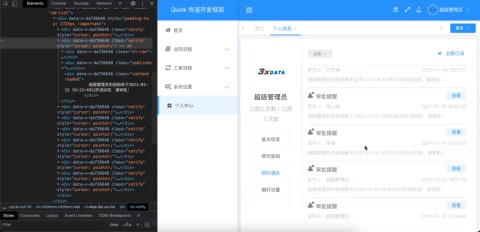

## 介绍

该插件利用分片渲染的方法解决超长列表的渲染问题，能将列表dom数量始终控制在一个pageSize,并且采用了预加载技术，能带来很好的零延迟加载的用户体验。



### 使用方法

- 安装

```
npm install virtual-list-engine --save
```

- 项目中引入

```javascript
// example.vue
<div class="oa-list" id="oa-list">
      <div>
        <div
          v-for="(item, index) in renderList"
          :key="index">
            ......
        </div>
      </div>
 </div>
<script>
   import virtuaListEngine from 'virtual-list-engine'
	 export default{
     data(){
       return{
         pageOpt: {
          pageSize: 15,
          pageNo: 1,
        },
        virtuaListEngine: null,
        allList: [],
       }
     },
     ...
     mounted() {
      this.virtuaListEngine = new virtuaListEngine('#oa-list', this.pageOpt, this.getList)
     },
     computed: {
      pointer() {
        return {
          start: this.virtuaListEngine ? this.virtuaListEngine.pointer.start : 0,
          end: this.virtuaListEngine ? this.virtuaListEngine.pointer.end : 0,
        }
      },
      renderList() {
        return this.allList.slice(this.pointer.start, this.pointer.end)
      },
    },
    method:{
      // 列表数据获取方法 pageOpt={pageSize,pageNo}
      getList(notice,pageOpt){
        ...
        this.allList = this.allList.concat(data.data.rows)
        notice && notice(this.allList.length)
        ...
      },
     destroyed() {
      this.virtuaListEngine.destroy()
    },
   }
</script>


```

- 实例属性

1. virtuaListEngine.pointer

```
 {
    prev: 0, // 上一代指针的开始指针
    start: 0, // 开始指针
    end: 10, // 结束指针
    next: 0, // 下一代指针的结束指针
  }
```

- 实例方法

1. virtuaListEngine.resetPointer() :将指针移动到初始位置

2. virtuaListEngine.destroy() :销毁实例的滚动条监听